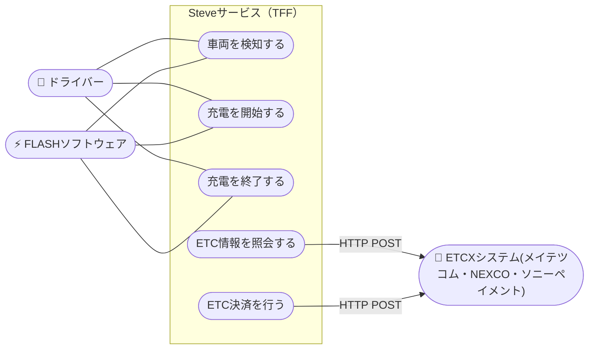

```mermaid
flowchart LR
  driver(["🙍 ドライバー"])
  flash(["⚡ FLASHソフトウェア"])

  subgraph system["Steveサービス（TFF）"]
    direction TB
    UC1(["車両を検知する"])
    UC3(["充電を開始する"])
    UC4(["充電を終了する"])
    UC2(["ETC情報を照会する"])
    UC5(["ETC決済を行う"])
  end

  etcx(["🏦 ETCXシステム(メイテツコム・NEXCO・ソニーペイメント)"])

  driver --- UC1
  driver --- UC3
  driver --- UC4

  flash --- UC1
  flash --- UC3
  flash --- UC4

  UC2 -->|HTTP POST| etcx
  UC5 -->|HTTP POST| etcx
```